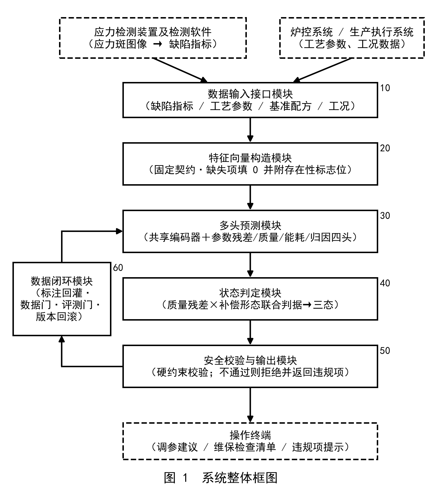
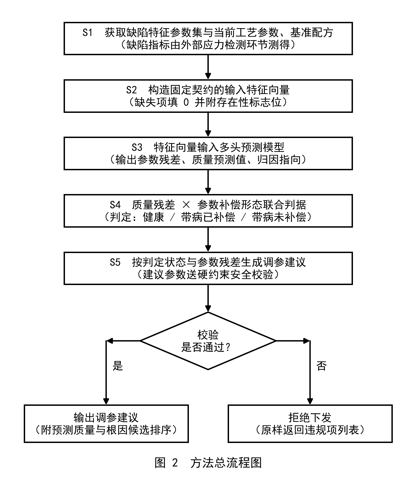
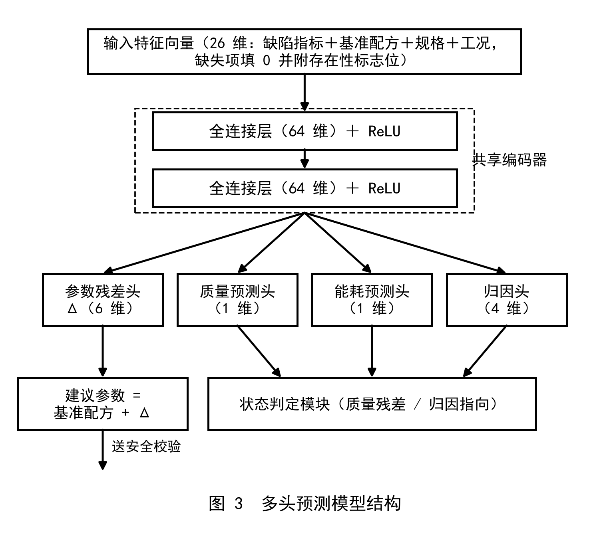
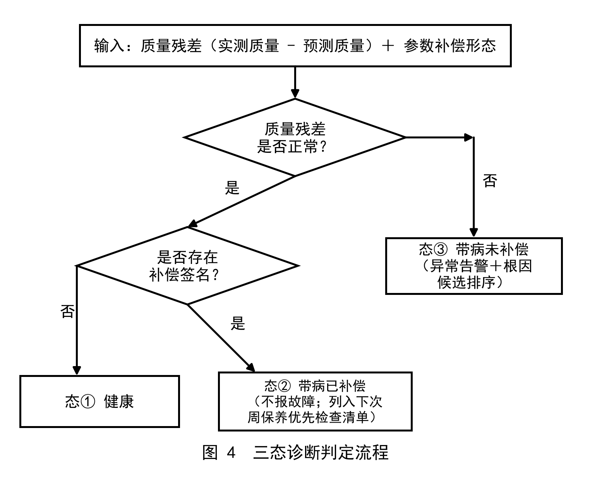
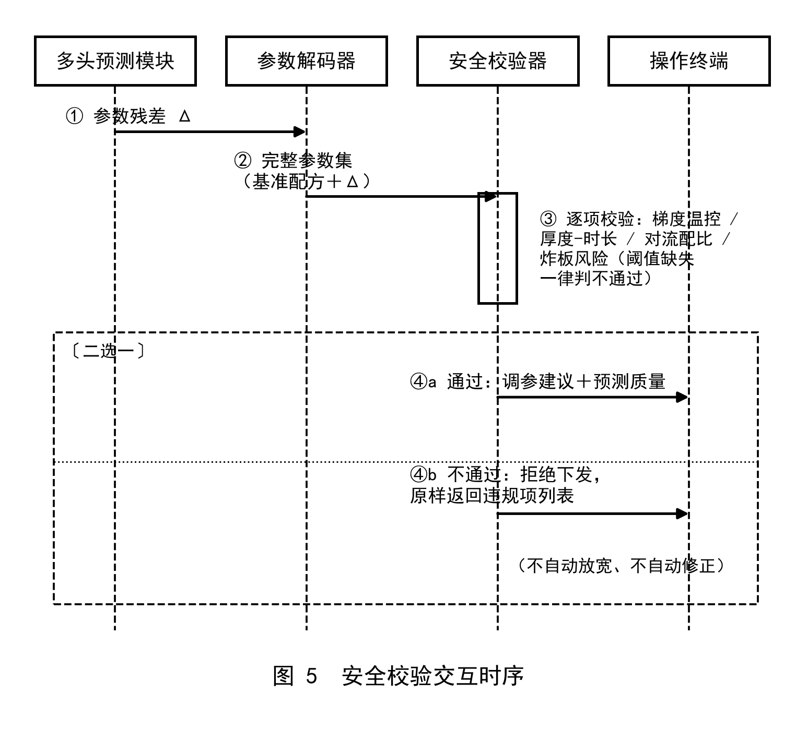
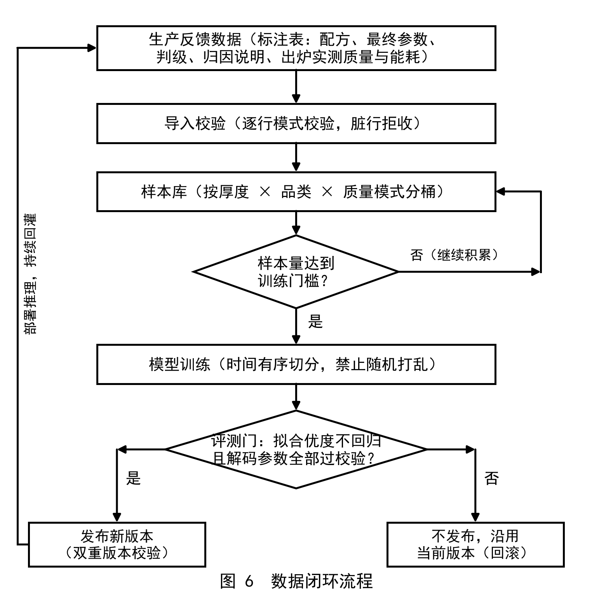

# 发明专利技术交底书（草稿）

> **卷首说明（提交代理前删除本块）**
>
> 1. 本稿为对 DFI269036 标注稿的全面重写：按代理文末总建议收敛为**单一主题**（围绕"工艺归因"方向的炉状态逆向诊断），六条批注的逐条回应位置见附录 A。
> 2. **范围决策（2026-08-19）**：应力斑指标计算（六指标打分、位置加权纹理指数、整床多片检测等）属**外部检测环节**的产出，不是本诊断系统的组成部分——缺陷指标在本申请中仅作为**输入数据**（训练与推理特征之一）出现，其算法本体不写入实施例、不进入权利要求。由此，指标算法此前随国标 §4.3 条文建议与检测软件交付发生的披露，**不再影响本申请**的新颖性；若将来要单独为指标算法申报，须核对其披露时间线并**先于标准条文公开提出申请**。
> 3. 全部实验数值来自本项目已完成的实测与验证，出处口径随文标注（附录 B）；旧稿"良率提升 1.5%–3%、能耗降低 12%–22%、年收益 80–160 万元"等无实测依据的数字已全部删除，不再使用。
> 4. 正文引用的应力斑分级限值（表 5）抄自在编国家标准草案（征求意见稿，2026-05-18）。正式条文如何引用（"在编国家标准草案"或"企业内控限值"）请代理定口径。
> 5. 附图 6 张已随稿提供（黑白线框，PNG，300dpi），由脚本生成，可按代理制图规范重绘。

## 术语约定

| 术语 | 含义 |
|---|---|
| 应力斑 | 钢化玻璃因内部应力分布不均在偏振光下呈现的可见光学不均匀图案（各向异性效应） |
| 缺陷特征参数集（缺陷指标） | 应力检测装置及配套检测软件对应力斑图像测量得到的一组标量指标（如光程差 95% 分位值、等色线覆盖率、纹理类指标等），作为本系统的输入数据 |
| 基准配方 | 该玻璃规格（厚度 × 品类 × 质量模式）下的标准工艺参数组 |
| 参数残差 Δ | 实际（或建议）工艺参数与基准配方的逐字段差值 |
| 质量残差 | 实测质量与模型预测质量之差 |
| 补偿签名 | 参数空间的局部凸起形态：某加热分区设定值相对基准配方及邻区中位值的异常抬高幅度（℃） |
| 三态 | 炉体运行状态判定结果：健康 / 带病已补偿 / 带病未补偿 |
| 硬约束安全校验 | 独立于模型之外的工艺参数规则校验器，任一规则不通过即拒绝参数下发 |
| 存在性标志位 | 与可缺失特征成对的 0/1 指示位：该特征实测可得为 1，缺失（填 0 值）为 0 |

单位约定：温度 ℃，时间 s，长度 mm，光程差 nm。

---

## 一、发明名称

候选一（推荐）：**一种基于应力斑检测特征的对流钢化炉运行状态逆向诊断方法及系统**

候选二：一种钢化玻璃应力斑驱动的钢化炉健康状态判定与调参建议生成方法及系统

（最终定名由代理人裁定。）

## 二、技术领域

本发明涉及玻璃深加工设备智能运维技术领域，具体涉及一种以钢化玻璃应力斑检测指标为输入、对对流钢化炉的运行状态进行逆向诊断，并生成经安全校验的工艺参数调整建议的方法及系统。

## 三、背景技术

对流钢化炉生产钢化玻璃的质量管控，目前普遍是"设定工艺参数 → 加热钢化 → 出片后检测判级"的**开环正向流程**，存在以下技术问题：

**（一）缺陷无法自动回溯到工艺环节。** 钢化玻璃出现应力斑等光学缺陷后，现有产线无法自动反推缺陷源自哪一工艺环节——是上部/下部炉温设定不当、分区温控失衡、对流风速或上下配比异常、还是加热时长不足；只能依靠有经验的操作人员停机排查、逐项试错，滞后且不可复制。

**（二）检测环节与调参环节脱节。** 应力斑检测仪器与判级方法已日趋标准化，能够输出光程差分位值、等色线覆盖率、纹理指标等多项缺陷指标；但这些指标目前只用于成品验收判级，**没有与工艺参数、基准配方、炉体工况联合建模**——检测结果携带的工艺环节信息（不同分区、不同风口的异常在指标上留下不同签名）未被利用，"检测出问题"与"知道怎么调"之间没有自动通道。

**（三）隐性补偿掩盖设备损耗。** 炉内加热元件损耗后实际炉温达不到设定值是行业常态；现场的标准补救做法是调高损耗元件邻近分区的设定参数进行补偿，补偿后成品质量可保持正常。这一实践导致：设备损耗被"藏"进参数空间——只看成品质量完全不可见，只看参数偏离又会把合理补偿误判为工艺失调；损耗持续演进，直至补偿失效产生批量废品甚至炸炉风险才暴露。该判断长期依赖个别老师傅的经验，无法传承、无法自动化。

**（四）已有智能化方案不闭环、无安全约束。** 基于图像分类的良/不良判定方案只能"事后识别"，无法输出可执行的参数调整量；纯数据驱动的参数推荐方案则缺乏工艺硬规则约束，模型输出可能违反梯度温控、单次调温幅度等安全边界，产线不敢采用；且多数方案依赖云端推理，存在时延、断网失效与工艺数据外泄风险。

因此，本领域需要一种能够利用已有检测环节输出的缺陷指标、从玻璃成品自动反推炉体运行状态（含"带病已补偿"这一隐性状态）、并输出经硬约束安全校验的调参建议的本地化方法及系统。

## 四、发明内容

### 4.1 发明目的

针对上述技术问题，本发明的目的在于提供一种基于应力斑检测特征的对流钢化炉运行状态逆向诊断方法及系统：

1. 以检测环节输出的缺陷指标与工艺参数、基准配方、炉体工况**联合建模**，建立"玻璃成品缺陷 → 工艺环节"的自动回溯通道（对应问题一、二）；
2. 引入"质量残差 × 参数补偿形态"联合判据，将炉体状态判定为健康 / 带病已补偿 / 带病未补偿三态，既不把常态性补偿误报为故障，又能检出被补偿掩盖的元件损耗，且**无需故障标签**（对应问题三）；
3. 调参建议经独立于模型之外的硬约束安全校验，通过才输出、不通过即拒绝并返回违规项，全流程本地部署运行；并以数据门、评测门、版本回滚机制构成可持续的数据闭环（对应问题四）。

### 4.2 技术方案总述

本发明的系统由五个模块组成（见图 1），缺陷指标的测量由外部应力检测环节完成，不属于本系统：

**数据输入接口模块（10）**：接收应力检测装置及配套检测软件对应力斑图像测量得到的缺陷特征参数集（至少包括光程差 95% 分位值、等色线覆盖率、纹理类指标），以及来自炉控系统/生产执行系统的当前工艺参数、基准配方与炉体工况数据。

**特征向量构造模块（20）**：将上述数据按固定契约组装为输入特征向量；可缺失特征以零值填充并附存在性标志位，模型自行学习"缺值"的含义（实施例一）。

**多头预测模块（30）**：共享编码器多头预测模型，四个输出头分别给出相对基准配方的工艺参数残差 Δ、质量预测值、能耗预测值、归因指向（实施例二）。

**状态判定模块（40）**：依据"质量残差"与"参数补偿形态（补偿签名）"的联合判据，将炉体运行状态判定为健康 / 带病已补偿 / 带病未补偿三态；生成根因候选并按置信度排序（实施例三）。

**安全校验与输出模块（50）**：将参数残差 Δ 叠加到基准配方解码为完整参数集，送硬约束安全校验器逐项校验；通过则输出调参建议（附预测质量与根因候选），不通过则拒绝下发并原样返回违规项列表——校验器独立于模型之外，规则永不并入模型权重，不自动放宽、不自动修正（实施例四）。配套数据闭环模块（60）以标注回灌、数据门、评测门与版本回滚维持模型持续更新（实施例五）。

方法流程 S1–S5 见图 2。

### 4.3 有益效果

以下效果均以本项目实测数据支撑（口径随文标注）：

**E1 缺陷—参数—工况联合建模打通回溯通道。** 检测指标不再止步于验收判级，而是与工艺参数、基准配方、炉体老化协变量联合输入统一模型，缺陷得以归因到具体工艺环节并转化为参数调整量。所选缺陷指标的信息量有实测支撑：在 115 片带人工评分的产线样本集上，输入所用纹理类缺陷指标与人工质量评分的 Spearman 秩相关达 −0.894（并列取平均秩口径）——检测环节输出的指标足以承载逆向诊断所需的信号。

**E2 三态判定兼容工业现实。** "带病已补偿"作为独立状态被识别而**不报故障**——避免把行业常态误报为异常；同时通过联合判据检出"质量正常但存在补偿签名"的隐性损耗，将其转化为下次周保养的优先检查清单。补偿幅度本身构成元件健康度的免费观测量（周保养换件前后参数轨迹天然标注损耗的爬升与回落），因此**无需故障标签**即可运行。

**E3 建议要么合规、要么拒绝。** 硬约束校验器在模型之外独立运行：任一规则不通过即整组拒绝并返回违规项；规则阈值缺失时一律判"无法判定→不通过"，炸板风险规则未配置时保守判为有风险。不存在"部分放宽"的中间态，可审计、可追责。

**E4 多头结构降低专家标注需求。** 稀缺的专家调参标签只需训练"最后一公里"的参数决策；"读懂这炉玻璃"的共享表示由随生产自动产生的实测质量/能耗标签训练（辅助任务相当于对共享表示的正则化），小数据场景可用。

**E5 闭环更新不过门不发布。** 新模型版本须同时满足"质量拟合优度不劣于当前版本（容忍带 5%）"与"全部解码出参经安全校验零违规"方可发布，否则沿用当前版本（回滚），模型更新不会引入越界参数。训练—解码—校验全链路已在合成数据上完成连通性验证（400 步后验证集质量头 R²=0.956、能耗头 R²=0.975；该结果用于验证链路正确性，非生产环境精度声明）。

## 五、附图说明

- 图 1 为本发明系统整体框图；
- 图 2 为本发明方法总流程图（摘要附图）；
- 图 3 为多头预测模型结构图；
- 图 4 为三态诊断判定流程图；
- 图 5 为安全校验交互时序图；
- 图 6 为数据闭环流程图。

## 六、具体实施方式

以下结合附图给出五个实施例。实施例中的网络维度、门槛、容忍带等为一组经验证的可行取值，本领域技术人员可在等效范围内调整；凡属现场标定项，随文给出标定方法而非虚构数值。

### 实施例一：输入数据构成与特征契约（模块 10、20）

本实施例公开系统的全部输入数据项及其组装方式。

**1. 缺陷特征参数集（外部检测环节输出）。** 由应力检测装置（暗场偏光成像装置、扫描式应力仪等）及配套检测软件对应力斑图像测量得到，本系统按接口接收数值，不参与其计算。本实施采用的指标：光程差 95% 分位值（X0.95，nm，越小越好）、等色线覆盖率（IsoT，阈值 T=75nm 下光程差低于 T 的面积占比，%，越大越好）、组合纹理类指标（无量纲，越小越好）。上述指标均有标准化测量方法（前两者见在编国家标准草案）。缺陷特征参数集还可扩展纳入表征缺陷空间分布的位置类指标——空间分布携带工艺环节定位信息，实测（115 片人工标注集）纹理类指标与人工质量评分的秩相关达 −0.894，信息量充分。

**2. 工艺侧输入。** 当前工艺参数与基准配方（各含：分区温度组及角色标注（中心/边部）、上部/下部炉温、对流风速、上下对流配比、摆动速度、摆动幅度、加热时长）、玻璃规格（厚度、品类）、质量模式（高品质/高效率）、炉体工况（投产日期、上次大修日期，用于推算老化协变量），来自炉控系统/生产执行系统或人工录入。

**3. 特征契约（表 1）。** 输入特征向量为 26 维固定顺序契约；**缺失特征不填占位数值**，一律填 0 并附存在性标志位，由模型自行学习"缺值"的含义；新增特征只允许在尾部追加（不破坏已训练权重的列对应），契约以列名摘要（SHA-256 指纹）跨机器校验。

**表 1 输入特征契约（26 维）**

| 序号 | 特征 | 单位/取值 | 说明 |
|---|---|---|---|
| 1 | 玻璃厚度 | mm | 规格 |
| 2 | 上部炉温设定 | ℃ | 工艺参数 |
| 3 | 下部炉温设定 | ℃ | 工艺参数 |
| 4 | 对流风速设定 | 设备口径 | 工艺参数 |
| 5 | 上下对流配比 | 无量纲 | 工艺参数 |
| 6 | 摆动速度 | 设备口径 | 工艺参数 |
| 7 | 摆动幅度 | 设备口径 | 工艺参数 |
| 8 | 加热时长 | s | 工艺参数 |
| 9–12 | 分区温度统计量（均值/最大/最小/标准差） | ℃ | 标准差取总体口径，单区时为 0 |
| 13–14 | 玻璃品类独热（超白/普通） | 0/1 | 规格 |
| 15–16 | 质量模式独热（高品质/高效率） | 0/1 | 订单口径 |
| 17–18 | 光程差 95% 分位值 + 存在位 | nm；0/1 | 缺陷指标（外部检测输出） |
| 19–20 | 等色线覆盖率（T=75nm）+ 存在位 | %；0/1 | 缺陷指标（外部检测输出） |
| 21–22 | 组合纹理指标值 + 存在位 | 无量纲；0/1 | 缺陷指标（外部检测输出） |
| 23–24 | 炉龄 + 存在位 | 年；0/1 | 投产日期推算；日期晚于样本时刻判脏数据按缺失处理 |
| 25–26 | 距上次大修天数 + 存在位 | 天；0/1 | 炉体老化协变量 |

### 实施例二：多头预测模型与训练方法（模块 30；图 3）

本实施例公开使模型可训练、可验证、可部署的全部要素。

**1. 网络结构（表 2、图 3）。**

**表 2 网络结构**

| 层 | 结构 | 输出维度 |
|---|---|---|
| 共享编码器 | 全连接(26→64) + ReLU + 全连接(64→64) + ReLU | 64 |
| 参数残差头 | 全连接(64→6) | Δ（6 维） |
| 质量预测头 | 全连接(64→1) | 质量分 |
| 能耗预测头 | 全连接(64→1) | 能耗 |
| 归因头 | 全连接(64→4) | 归因类目弱标签 |

参数残差 Δ 的 6 个分量依次对应：上部炉温、下部炉温、对流风速、上下对流配比、摆动幅度、加热时长；建议参数 = 基准配方 + Δ（分区温度组沿用基准；其纳入 Δ 空间设有预注册判据——首批 30 条真值标注中分区温度被专家改动的样本占比 ≥20% 才纳入，防止事后挑选规则）。

**2. 损失函数。** 多任务不确定性加权：每头一个可学习对数方差 s_h，

  L_total = Σ_h ( exp(−s_h)·L_h + s_h )  ……(1)

各头 L_h 取均方误差。初始值：参数头 s=0.0，质量/能耗/归因头 s=1.0——副任务以较大初始不确定性（较小权重）起步，防止淹没主任务（负迁移）。多头共享编码器的意义见有益效果 E4。

**3. 训练样本与标签来源。** 训练数据来自生产标注表（结构见实施例五表 6）：参数头标签 = 专家最终参数 − 基准配方（逐字段差）；质量头标签 = 出炉实测判级的数值编码（A=1.0、B=0.5、C=0.0，训练编码可调，非标准真值）或实测质量分；能耗头标签 = 出炉实测能耗；归因头标签 = 专家书面归因说明整理的类目弱标签。只收专家复核确认（真值标记）且基准配方齐全的样本，无基准的样本剔除、不猜测。

**4. 防泄漏两条纪律。**（a）参数头的输入特征必须以**基准配方**顶替最终参数后构造——模型看到的是"调参前"的状态，否则最终参数（=答案）泄漏进输入；（b）训练/验证/测试按时间有序切分（验证、测试各 20%），禁止随机打乱，同一炉次/同一天的样本不得跨集——评估面向未来数据，诚实反映概念漂移。

**5. 训练门槛与验证。** 真实数据训练设样本量门槛（起步 30 条，目标 200 条，按厚度×品类×质量模式分桶深覆盖），不足门槛时报错退出，**绝不以模拟数据顶替**。训练—解码—校验链路已在合成数据发生器（已知数据生成过程+概念漂移斜坡）上完成连通性验证：400 步后验证集质量头 R²=0.956、能耗头 R²=0.975；该数值仅证明"多头确实能学、时间切分与评测门有效"，非生产精度声明。

**6. 模型输出到工艺参数的映射。** Δ → 叠加基准配方（建议参数 = 基准配方 + Δ ……(2)）→ 结构合法性修正（仅保证字段正性等结构约束，**不做任何安全判定**）→ 完整参数集 → 交实施例四的安全校验器。安全永远由校验器强制，解码层不承担。

**7. 质量—能耗权衡的实现方式（对旧稿"博弈优化"的按实重写）。** 本发明不设独立的优化求解模块。质量与能耗为同一模型的两个预测头；订单的质量/效率取向以"质量模式"独热特征进入输入（高品质/高效率两桶），参数头在对应桶内拟合专家的最优决策。以优化语言表述：目标=拟合专家参数决策（监督学习），决策变量=6 维参数残差，硬约束=安全校验规则集（模型外强制），触发条件=每炉次评估请求。

### 实施例三：三态逆向诊断判定（模块 40；图 4）

本实施例公开发明核心的状态判定逻辑。

**1. 诊断信号。**（a）质量残差 = 实测质量 − 质量头预测值。质量头预测的是"在当前参数与当前缺陷指标下应有的质量"，显著负向偏离即质量异常——该检测不需要任何故障标签；（b）参数补偿形态（补偿签名）：逐分区计算设定值相对基准配方及邻区中位值的抬高幅度（℃），存在超过标定阈值的局部凸起即判"存在补偿签名"。信号以"信号名/比较方向/阈值/结论"四元组规则行表达，规则与阈值配置化存储、运行时读取，修改即时生效、不改代码。

**2. 三态判定（表 3、图 4）。**

**表 3 三态判定**

| 状态 | 判定条件 | 系统动作 |
|---|---|---|
| ① 健康 | 质量残差正常 且 无补偿签名 | 正常放行 |
| ② 带病已补偿 | 质量残差正常 且 存在补偿签名 | **不报故障**；识别被补偿元件，列入下次周保养优先检查清单 |
| ③ 带病未补偿 | 质量残差异常（伴或不伴补偿签名） | 异常告警 + 根因候选按置信度排序输出 |

**3. 联合判据（本发明的关键认定，区别于常规残差监控）。** 工业现实中"带病运转+邻区补偿"是常态而非异常，因此：质量残差正常 **≠** 设备健康（补偿会掩盖损耗）；参数偏离基准大 **≠** 工艺失调（可能是合理补偿）。元件损耗的检测量必须是**质量残差状态与参数补偿形态的联合判断**——任何单一量都会系统性误判。本发明将该联合判据实现为图 4 的二级判定。

**4. 补偿签名阈值的标定方法（不依赖故障标签）。** 周保养换件/修复前后的参数轨迹是元件健康度的天然观测：损耗期补偿量单调爬升、保养后回落。以若干个保养周期的"抬高幅度—回落幅度"统计分布划定判定阈值（例如取历史回落幅度分布的低分位为下限），即可完成标定；随保养记录积累可持续修正。

**5. 根因候选与置信度排序。** 候选集 = 归因头输出指向的工艺环节（温控类/对流类/时长类/设备损耗类弱标签类目）∪ 规则库命中项（如"缺陷指标超阈且集中于特定形态→疑似局部过热/欠温"、"补偿签名超阈→疑似该分区元件损耗"）。置信度 = 归因头输出向量归一化分量与规则命中强度（信号超阈幅度归一化）的加权融合；按置信度降序输出，每个候选附对应的调参方向（Δ 的相应分量）或维保动作（优先检查的分区与元件）。规则阈值按第 4 节方法及合格/判废样片锚定法标定。

**6. 混杂控制（训练侧配套）。** 专家最终参数 = 工艺需求 + 设备补偿两种成分的混合；为避免把补偿量学成工艺规律（遗漏变量偏倚），配套轻量《元件问题登记表》（日期/时段/疑似元件/现象/补偿分区与幅度/恢复时间六列），与标注表按日期+时段对齐；训练时先将"补偿期样本"作分层变量做敏感性分析（含/不含各训一版对比），效应显著再将设备状态升为输入特征；不预先删除数据。

### 实施例四：安全校验交互与调参建议生成（模块 50；图 5）

本实施例公开诊断链与安全校验器的数据交互及校验规则实体。

**1. 交互数据项（图 5）。** 多头预测模块 → 解码器：6 维参数残差 Δ；解码器 → 校验器：完整参数集（分区温度数组及其角色标注（中心/边部）、上部/下部炉温、对流风速、上下对流配比、摆动速度、摆动幅度、加热时长、玻璃品类、厚度、质量模式，另含可选的对流风温与风机启动逻辑字段）与上一组生效参数（供调温幅度校验）；校验器 → 输出端：校验结论（是否通过 / 梯度是否合规 / 是否存在炸板风险）与违规项列表——每条违规为带规则编号的人类可读文本，原样透传，不改写、不截留。

**2. 梯度温控类规则（表 4，本实施生效阈值及临界行为）。**

**表 4 梯度温控类校验规则**

| 规则 | 内容 | 阈值 | 临界验收行为 |
|---|---|---|---|
| G-a | 中心区最低温 > 边部区最高温 | 结构规则 | 等于即不通过 |
| G-b | 上部炉温 > 下部炉温 | 结构规则 | 等于即不通过 |
| G-c | 相邻分区温差 | ≤5℃ | 5.00℃ 通过，5.01℃ 不通过 |
| G-d | 单次调温幅度（相对上组参数逐区） | ≤±3℃ | 3.00℃ 通过，3.01℃ 不通过 |

阈值均存于配置文件、每次校验时重新读取（修改即时生效），禁止硬编码。厚度—加热时长映射区间、对流风速/配比区间、温度梯度上限与炸板风险判定规则同法配置；其取值依据设备厂商工艺窗口与本厂历史合格参数分布划定（属现场标定项，本文不虚构数值）。

**3. 可靠性设计三条（缺值语义）。**（a）任一规则阈值缺失 → 该项判"无法判定 → 不通过"，并在违规项中写明缺失项，**绝不以占位数值放行**；（b）炸板风险判定规则未配置 → 保守置"存在炸板风险"并计违规（无规则=无法排除）；（c）校验不通过时整组拒绝、原样返回违规项，**不自动放宽阈值、不自动修正参数**——自动放宽等价于闸门失效，修正权只属于人。

**4. 规则优先于模型。** 校验器独立于模型之外，规则永不并入模型权重（与"将工艺规则蒸馏进模型"的方案有本质区别：规则在权重内不可审计、不可即时修订、更新须重训练）。模型的任何输出均以校验器为最终裁决。

**5. 与三态诊断的一致性。** 状态②的补偿参数可能超出 G-c/G-d 限值：校验器**照拦不放宽**（提示该参数组未过安全校验、系统不下发），但三态诊断照常判定、样本照常入库训练——"未过校验的专家最终参数"是合法训练样本而非脏数据；补偿模式的专用限值口径经工艺与维修专项确认后仅需修订配置文件。

**6. 质量分级参照（表 5）。** 出炉实测判级（质量头标签来源之一）按在编国家标准草案的分级限值执行（判级方向：X0.95 越小越好，"≤A 上限判 A"；IsoT 越大越好，"≥A 下限判 A"；查表取"适用厚度 ≥ 查询厚度"的最小行，超出表列厚度按草案由供需双方商定，系统如实返回"无法判级"）：

**表 5 应力斑分级限值（在编国家标准草案）**

| 公称厚度 (mm) | X0.95 A/B 上限 (nm) | IsoT A/B 下限 (%) | 组合纹理特征 A/B 上限 |
|---|---|---|---|
| ≤6 | 70 / 95 | 95 / 85 | 0.43 / 0.57 |
| ≤8 | 80 / 120 | 90 / 68 | 0.49 / 0.71 |
| ≤10 | 95 / 140 | 85 / 52 | 0.57 / 0.82 |
| ≤12 | 115 / 155 | 70 / 30 | 0.68 / 0.90 |
| ≤15 | 130 / 165 | —（商定） | 0.76 / 0.96 |

### 实施例五：数据闭环与模型更新（模块 60；图 6）

本实施例公开反馈数据结构、更新触发、更新方法与离线验证回滚机制。

**1. 反馈数据结构（表 6）。** 标注表 39 列，按功能分组：

**表 6 反馈数据结构（生产标注表，39 列按组摘要）**

| 组 | 字段（摘要） | 填写人/时机 |
|---|---|---|
| 标识 | 样本号、时间、操作员、来源 | 系统 |
| 规格分桶键 | 厚度、品类、质量模式 | 系统/记录员 |
| 输入指标 | X0.95、IsoT、组合纹理值及标定状态、应力斑图像路径与摘要值、工况备注 | 系统（指标值来自外部检测环节） |
| 基准配方（9 项） | 分区温度组及角色、上/下部炉温、对流风速、配比、摆动速度/幅度、加热时长 | 系统（只读） |
| 最终参数（9 项） | 同上结构 | 专家 |
| 判级与归因 | 专家主观判级（A/B/C）、书面归因说明（作归因弱标签）、成因标签 | 专家 |
| 复核一致性 | 真值标记、重复组号 | 专家/系统 |
| 出炉实测 | 实测判级、实测能耗（kWh） | 出炉后回填 |

导入即逐行模式校验（字段类型、枚举、分区温度与角色个数一致性），脏行拒收；缺值留空不猜测；图像以"路径+SHA-256 摘要"与结构化数据分离存放（图像仅存档溯源，本系统不作图像计算）。覆盖策略：桶=厚度×品类×质量模式，深覆盖少数高产桶优于薄铺全部桶；抽取 10–15 个情形隔时重标（共用重复组号）以估计标注方差。设备补偿期以《元件问题登记表》按日期+时段对齐（实施例三第 6 节）。

**2. 更新触发与方法。** 触发 = 数据门：可用真值样本达到门槛（起步 30 条、目标 200 条）；更新方法 = 起步阶段只训练参数头（其余头待各自标签量达标后逐头开放）；切分按时间有序（实施例二第 4 节）。

**3. 离线验证与回滚（评测门）。** 新版本发布须同时满足：（a）质量拟合优度不劣于当前已发布版本（回归容忍带 5%，即新误差 ≤ 旧误差 × 1.05）；（b）验证集全部样本的解码出参经安全校验**零违规**；（c）参数残差平均绝对误差不超过按专家数据分布标定的合格线（该线待首批真值数据到位后划定，未划定时门以 (a)(b) 把关）。任一不满足 → 不发布，沿用当前版本（回滚）。发布物带特征契约与 Δ 契约的 SHA-256 指纹及版本号双重校验，跨机器导入时指纹不符即拒绝加载。

**4. 运行闭环。** 部署推理 → 每炉生产产生新标注与出炉实测 → 回灌样本库 → 达门槛再训练 → 过评测门再发布（图 6）。冷启动期（无训练数据）由确定性规则+人工复核产出首批标注，模型逐步接管；系统永不自动改炉，专家拍板后应用，"未过校验的参数单不执行"为操作纪律。

## 七、权利要求书（申请人建议稿，供代理定稿）

**1.** 一种对流钢化炉运行状态逆向诊断方法，其特征在于，包括以下步骤：

S1、获取待诊断钢化玻璃的缺陷特征参数集、当前工艺参数与基准工艺配方，所述缺陷特征参数集由应力检测环节对所述钢化玻璃的应力斑图像测量得到，至少包括光程差分位值与纹理类指标；

S2、将所述缺陷特征参数集、当前工艺参数、基准工艺配方与炉体工况数据构成输入特征向量；

S3、将所述输入特征向量输入多头预测模型，得到相对基准工艺配方的工艺参数残差、质量预测值和归因指向，所述多头预测模型包括共享编码器以及至少参数残差头、质量预测头与归因头；

S4、根据实测质量与所述质量预测值之间的质量残差、以及当前工艺参数相对基准工艺配方的补偿形态，按联合判据将钢化炉运行状态判定为健康、带病已补偿、带病未补偿三种状态之一；

S5、根据判定状态与所述工艺参数残差生成调参建议，所述调参建议经独立于所述多头预测模型之外的硬约束安全校验通过后输出；校验未通过时拒绝输出该调参建议并返回违规项。

**2.** 根据权利要求 1 所述的方法，其特征在于，所述输入特征向量中的可缺失特征以零值填充并附存在性标志位。

**3.** 根据权利要求 1 所述的方法，其特征在于，所述缺陷特征参数集还包括表征缺陷空间分布的位置类指标。

**4.** 根据权利要求 1 所述的方法，其特征在于，所述多头预测模型还包括能耗预测头；各头损失以可学习的不确定性权重加权求和，且质量预测头、能耗预测头与归因头的初始不确定性大于参数残差头。

**5.** 根据权利要求 1 所述的方法，其特征在于，所述多头预测模型通过如下方式训练得到：参数残差标签为专家最终参数与基准工艺配方的逐字段差值；参数残差头的输入特征以基准工艺配方替换最终参数后构造；训练集、验证集与测试集按样本时间有序切分且同一炉次的样本不跨集。

**6.** 根据权利要求 1 所述的方法，其特征在于，所述补偿形态由补偿签名表征，所述补偿签名为某一加热分区设定值相对基准工艺配方及相邻分区中位值的抬高幅度超过标定阈值的参数空间局部凸起。

**7.** 根据权利要求 6 所述的方法，其特征在于，所述联合判据为：质量残差正常且无补偿签名时判定为健康；质量残差正常且存在补偿签名时判定为带病已补偿，并将对应分区列入维护保养优先检查清单而不产生故障告警；质量残差异常时判定为带病未补偿并输出按置信度排序的根因候选。

**8.** 根据权利要求 6 所述的方法，其特征在于，所述标定阈值依据维护保养前后工艺参数轨迹中补偿幅度的爬升与回落统计分布确定。

**9.** 根据权利要求 1 所述的方法，其特征在于，所述硬约束安全校验至少包括梯度温控校验、厚度—加热时长校验、对流参数校验与炸板风险校验；任一校验项的阈值缺失时该项判定为不通过；炸板风险判定规则缺失时保守判定为存在风险；校验未通过时不放宽阈值、不修正参数。

**10.** 一种对流钢化炉运行状态逆向诊断系统，其特征在于，包括：数据输入接口模块，用于接收应力检测环节输出的缺陷特征参数集以及当前工艺参数、基准工艺配方与炉体工况数据；特征向量构造模块，用于执行权利要求 1 所述步骤 S2；多头预测模块，用于执行权利要求 1 所述步骤 S3；状态判定模块，用于执行权利要求 1 所述步骤 S4；安全校验与输出模块，用于执行权利要求 1 所述步骤 S5；所述各模块部署于产线本地计算设备。

**11.** 根据权利要求 10 所述的系统，其特征在于，还包括数据闭环模块，用于接收生产反馈数据并经逐行模式校验后入库，在样本量达到训练门槛时触发模型更新；更新后的模型须同时满足质量拟合优度不劣于当前版本、且验证集全部解码参数经硬约束安全校验零违规，方可发布，否则沿用当前版本。

**12.** 一种计算机可读存储介质，其上存储有计算机程序，其特征在于，所述程序被处理器执行时实现权利要求 1 至 9 中任一项所述的方法。

**撰写说明（给代理）：**
- 独立权利要求 1 的最小必要特征链为"缺陷指标+参数联合输入→多头模型→三态联合判定→模型外安全校验"；能耗头、存在性编码、训练方式、闭环更新均已下沉从权。
- **缺陷指标的计算方法（六指标打分、位置加权纹理指数、整床多片检测等）不在本申请主张范围**——其属外部检测环节，本申请以"应力检测环节测量得到"接口化引用；如需保护指标算法本体可另行申报（注意其已有国标条文建议与软件交付的披露时序，须先于标准公开提出申请）。
- 三态判定已绑定具体测量量（质量残差、分区设定抬高幅度）与计算特征，以规避"智力活动规则"质疑；置信度排序的计算方式在说明书实施例三第 5 节公开，如需入权可引该定义。
- 以下内容有意仅置于说明书、不进权利要求：冷启动流程、标注表具体列名、分桶覆盖策略、主观判级数值编码（属实现细节或经营方法色彩较重）。

## 八、说明书摘要

本发明公开一种基于应力斑检测特征的对流钢化炉运行状态逆向诊断方法及系统：获取应力检测环节对应力斑图像测得的缺陷特征参数集，与当前工艺参数、基准配方及炉体工况构成固定契约的输入特征向量，缺失特征填零并附存在性标志位；输入共享编码器多头预测模型，得到相对基准配方的参数残差、质量预测值与归因指向；依据实测质量与预测质量之差和参数空间补偿形态的联合判据，将炉体判定为健康、带病已补偿、带病未补偿三态，识别被邻区补偿掩盖的元件损耗而不误报常态补偿；按判定状态与参数残差生成调参建议，经独立于模型之外的硬约束安全校验通过后输出，未通过则拒绝并返回违规项，实现从检测结果到炉体状态的自动回溯与可审计本地闭环调参。（摘要附图：图 2）

---

## 附录 A：代理批注（DFI269036）逐条回应对照

| 批注 | 原稿缺失 | 本稿回应位置 |
|---|---|---|
| 批注 0（光学采集：硬件参数、标定、图像→特征步骤缺失） | 图像如何转成缺陷特征 | 策略调整：图像采集与指标计算整体划归**外部检测环节**，不在本申请主张范围（权 1 S1"由应力检测环节测量得到"接口化）；本申请只需定义输入数据字段（实施例一表 1），指标均有标准化测量方法可依，公开充分性不再依赖采集硬件细节 |
| 批注 1（多 AGENT 协同：I/O 数据项、时序、置信度仲裁、安全约束方式缺失） | 协同机制不可实施 | 主题收敛后"协同"落实为诊断链内模块交互：交互数据项与时序见实施例四第 1 节、图 5；根因候选与置信度融合排序见实施例三第 5 节；安全校验对模型输出的约束方式（规则优先、拒绝不放宽）见实施例四第 3、4 节 |
| 批注 2（模型：样本、标签、特征、结构、损失、训练参数、精度、输出映射缺失） | 模型不可复现 | 实施例一表 1（26 维特征契约）；实施例二全部：表 2（网络结构）、式 (1)（损失）、标签来源、防泄漏与时间切分、训练门槛、管线验证数值（含诚实限定语）、Δ→参数映射；图 3 |
| 批注 3（规则库：阈值实体、依据、格式、冲突消解缺失） | 规则库不可建立 | 实施例四：表 4（梯度温控阈值与临界行为）、表 5（分级限值）、规则四元组表达格式（实施例三第 1 节）、配置化与缺值语义、"规则优先于模型、拒绝不放宽"的消解机制；未定阈值给出确定依据而非虚构数值 |
| 批注 4（博弈优化：目标函数、变量、约束、触发缺失） | 优化不可复现 | 按实重写：本方案无独立优化模块，质量/能耗为双预测头+质量模式分桶；优化语言表述（目标/变量/约束/触发）见实施例二第 7 节 |
| 批注 5（闭环：数据结构、触发、方法、验证回滚缺失） | 闭环不可实施 | 实施例五全部：表 6（反馈数据结构）、数据门、只训参数头起步、评测门双条件+版本指纹校验+回滚；图 6 |
| 文末总建议（主题过散，建议聚焦单一 AGENT，推荐工艺归因方向） | 无核心技术贡献 | 全稿收敛为"缺陷指标+工艺参数联合建模→炉状态逆向诊断→安全校验后调参建议"单一发明构思；感知/打分层亦被剥离出保护范围，主题进一步收窄；代理点名要求的输入数据构成、关联建模、根因候选与置信度排序、与安全校验的交互、调参建议生成逻辑分别落于实施例一/二/三/四 |

## 附录 B：实验数值出处（内部自查用，提交时可删）

| 数值 | 出处 |
|---|---|
| −0.894（纹理类指标 vs 人工评分，并列平均秩 Spearman） | 115 片人工标注集实测（data/derived/texture_w_doc/values.json；《W_w 技术说明》） |
| R²=0.956 / 0.975 | 合成模拟器管线连通性验证（docs/PROGRESS.md §2.3，training/train.py --synthetic --steps 400） |
| 5℃ / 3℃ 及临界行为（5.00 过 / 5.01 不过等） | config/thresholds.yaml + tools/constraints.py 单测口径 |
| 分级限值表（表 5） | config/grading.yaml（在编国标草案 2026-05-18 表 1/2/3） |
| 26 维特征契约、6 维 Δ、64 维编码器、损失初始值（0.0 / 1.0） | training/features.py、decode.py、model.py、losses.py |
| 30/200 样本门槛、0.2/0.2 切分、5% 容忍带、A/B/C=1.0/0.5/0.0、"30 条 ≥20%"预注册判据 | config/training.yaml |
| 标注表 39 列结构 | tools/make_annotation_template.py、schemas/archive.py、docs/标注说明.md |
| 三态口径、补偿签名、保养轨迹标定 | docs/设备带病运转与补偿_诊断口径.md、config/attribution.yaml |
